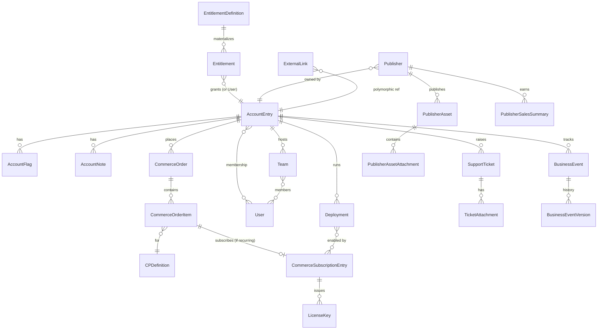

# Consolidated Customer Platform — Proposed System Spec

This document proposes the shape of the new workspace that replaces Koroneiki, Provisioning, Marketplace, and Support with one Liferay Objects–based system. It is a **design proposal**, not an implementation plan. Every contested decision is in a call-out box — **these are best-judgment defaults, open for review**; flag the ones you want to discuss.

Read the `../audit/` docs first if you haven't — this spec assumes them as context.

---

## 1. Goals & Non-Goals

**Goals**
- Single Liferay workspace, one deployable unit, one source of truth per concept (Account, Contact, Order/Subscription via Commerce, Deployment, etc.).
- Data model expressed as Liferay Objects so business users can extend fields without a release.
- Business logic in Object Actions, Validations, and Scheduled Tasks — not in standalone OSGi modules with their own data stores.
- Preserve the external contracts that live outside the four systems (Jira, Salesforce, GCS, Liferay Cloud, Analytics Cloud, Marketo, email, Slack).

**Non-goals**
- Re-architecting Jira ticketing, Liferay Commerce checkout, or Liferay Cloud provisioning.
- Migrating the 17M-row Koroneiki `AuditEntry` log (archive it).
- Building a new identity system — use Liferay Users.
- Keeping Zendesk, Dossiera, osb-entity-web, or RabbitMQ as internal infrastructure.

**Constraints**
- Must run on standard Liferay SaaS patterns (client extensions + site initializers + Objects + headless).
- Must support a phased cut-over — legacy systems run in parallel during migration.
- License-key generation cannot regress in correctness or throughput (230K active keys).

---

## 2. Design Decisions (open for review)

Each decision below changes the shape of the spec materially. If any of these is wrong, sections 3–9 need adjustment.

> **D1 — Account = Liferay `AccountEntry` + custom fields.** Do **not** introduce a separate `Account` Object.
>
> **Why:** `AccountEntry` already exists in Liferay, already used by Marketplace and Support, supports parent-child hierarchy, has membership semantics, and is referenced by Commerce. Introducing a parallel `Account` Object forks the model.
>
> **Added custom fields:** `koroneikiAccountCode` (unique, uppercased), `region`, `tier`, `status`, `internal`, `profileEmailAddress`, `salesforceId`. The `parentAccountEntryId` already exists on `AccountEntry`.
>
> **Alternative rejected:** standalone Koroneiki-style `Account` Object. Cleaner data model on paper; doubled work in practice because every Commerce/Support integration already expects `AccountEntry`.

> **D2 — Contact = Liferay `User` + account membership.** Do **not** introduce a separate `Contact` Object.
>
> **Why:** Koroneiki's Contact was a lazy mirror of osb-entity-web Users anyway (`Contact.uuid == User.uuid`). Collapsing to `User` drops the mirror and the osb-entity-web bridge. Account membership already expresses "this person belongs to that account."
>
> **Role catalog:** Liferay `Account Roles` (scoped per-AccountEntry) map directly to Koroneiki's `ContactAccountRole` (32,647 rows today). Role names are **prefixed** to preserve the `ACCOUNT_CUSTOMER` vs `ACCOUNT_WORKER` distinction at the permissions layer — e.g., `Customer_Member`, `Customer_Manager`, `Customer_Admin`, `Worker_Member`, `Worker_Manager`, `Worker_Admin`. Doubles the catalog but lets each set grant different permissions. Koroneiki role `type=Team` is dropped (see D3).
>
> Team membership uses a dedicated `Team` Object (see D3).
>
> **Alternative rejected:** flat Account Role catalog with customer-vs-worker distinction on a user global attribute. Simpler, but blocks "grant to Customer Admins but not Worker Admins"–style rules without joining the attribute everywhere.
>
> **Alternative rejected:** keep a Contact Object for the 20K Koroneiki Contacts. Forces a permanent User↔Contact sync layer, which is what we're trying to eliminate.

> **D3 — Team as a lightweight Object; TeamRole dropped.** Today Koroneiki has Team + TeamRole + TeamAccountRole, but `TeamAccountRole` has only 39 rows and `TeamRole` has 2 rows — the team-level role model is effectively unused.
>
> **Why:** Port `Team` (18,570 rows, actively used) as an Object with account relationship and user membership. Drop `TeamRole` / `TeamAccountRole`. The auto-synced "default team per account" logic ports over as an Object Action on AccountEntry save.
>
> **Alternative rejected:** full team-role port. Low ROI given the data.

> **D4 — Use OOTB Liferay Commerce for orders + subscriptions; add a `Deployment` Object for environment-specific attributes.**
>
> **Finding from the data:** Koroneiki `ProductPurchase` (65K rows) and Support `AccountSubscription` (4.5K rows) are **not** the same concept. ProductPurchase tracks *sales lines* — SKUs like "Gold Subscription," "DXP Production," "Mobile Experience" bought per SF close-won. AccountSubscription tracks *deployments* — environments like "Production," "Non-Production," "Development," "Backup," each with its own `instanceSize` and `hasDisasterDataCenterRegion`. Average customer has ~10 ProductPurchases enabling ~1 Deployment snapshot.
>
> **Why Commerce:** Commerce already handles order lifecycle, subscription term management, renewal logic. Rather than re-implementing with custom Objects, fold both concepts onto Commerce-native constructs plus a side Object for what Commerce doesn't model.
>
> **Mapping:**
> - Koroneiki `ProductPurchase` → `CommerceOrder` + `CommerceOrderItem` (one order per purchase, subscription-enabled items for recurring products).
> - Koroneiki `ProductEntry` → Commerce `CPDefinition` (product catalog).
> - Koroneiki `ProductConsumption` (149K rows) → collapses into `LicenseKey` Object (D8) — one license key per activation.
> - Support `AccountSubscription` → Commerce Subscription (`CommerceSubscriptionEntry`) for the term/status, **plus a new `Deployment` Object** for env attributes.
> - Support `AccountSubscriptionGroup` (3K) → Commerce subscription grouping (or a field on `Deployment`).
> - Support `AccountSubscriptionTerm` (13, near-unused) → dropped.
>
> **`Deployment` Object** carries what Commerce doesn't: `accountEntryId`, `name` (Production / Non-Production / Development / Backup / HA Production / …), `deploymentGroupERC`, `instanceSize`, `hasDisasterDataCenterRegion`, `startDate`, `endDate`, `status`. Relationship: `Deployment` ↔ many `CommerceSubscriptionEntry` (the purchases that enable it).
>
> **SF close-wons:** the Pub/Sub subscriber (D12) programmatically creates Commerce orders — one order per opportunity, order items per SKU, subscription-enabled items for recurring products. Commerce then handles term/renewal/grace natively instead of custom date-math.
>
> **Marketplace:** Commerce `CommerceOrder` already the pattern; `TrialProvisioning` Object (D7) carries trial-specific metadata.
>
> **Edge cases worth flagging:** some Koroneiki concepts may not map 1:1 to Commerce subscription fields (e.g., `originalEndDate` — sales-original before extensions/grace). Use custom fields on `CommerceSubscriptionEntry` for those.
>
> **Alternative rejected:** custom `Subscription` + `ProductPurchase` Objects (the revised-D4 sketch). Rebuilds what Commerce already does, and complicates the Marketplace story since Marketplace already uses Commerce.
>
> **Alternative rejected:** single Subscription Object collapsing both concepts (original-D4). The 65K vs 4.5K data shape says they're distinct.

> **D5 — Entitlements = Object filter criteria for simple rules, Scheduled Task for complex ones.**
>
> **Why:** Koroneiki's 62 `EntitlementDefinition.definition` rows are raw SQL. Most of them probably resolve to "Account has an Active Subscription for product X" or "Contact belongs to an Account with flag Y" — expressible as Liferay Object filter criteria on a relationship. The remainder (time-windowed, multi-join, aggregate-based) need a scheduled task that grants/revokes like Koroneiki does today.
>
> **Process:** extract all 62 live rules, classify each as (a) Object filter, (b) scripted Object Action, (c) scheduled task. Only (c) needs custom code. This cannot be fully designed without the rule review.
>
> **Alternative rejected:** full scheduled-task port of Koroneiki's SQL-grant-revoke loop. Keeps the abstraction that lets anyone write arbitrary SQL, which is exactly the maintenance risk we want to retire.

> **D6 — Tickets stay in Jira; workspace holds a thin `SupportTicket` Object that references Jira.**
>
> **Why:** Jira is the agent tool of record; absorbing ticket state into Liferay is a re-architecture of the wrong system. The existing Support workspace already treats Jira as authoritative. Port that pattern.
>
> **Fields on SupportTicket:** `accountEntryId`, `jiraIssueKey`, `jiraProject`, `subject`, `statusCached`, `priorityCached`, `lastSyncedAt`. Attachments stay as a separate `TicketAttachment` Object backed by GCS as today.
>
> **Cache freshness:** 1-hour TTL. The next render after an hour repulls from Jira; within the hour, serve cached values. Simpler than webhook sync, no endpoint to maintain, acceptable staleness for a support portal.
>
> **Zendesk:** already retired at the business layer — no migration work needed. The `zendeskTicketId` field on `TicketAttachment` and the Zendesk calls in `osb-provisioning` are vestigial code. Both drop during migration without compensating flows.
>
> **Alternative rejected:** model full ticket state in Liferay. Huge scope, no user win.
>
> **Alternative rejected:** webhook-driven sync from Jira. More responsive but requires maintaining inbound webhook endpoints and handling Jira's delivery semantics. Not worth it for a support portal's staleness tolerance.

> **D7 — Liferay Commerce remains for Marketplace checkout; `Order` is a Commerce construct, not an Object.**
>
> **Why:** Commerce already handles storefront, cart, payment, tax. Marketplace's "custom fields on CommerceOrder" pattern (`trial-end-date`, `cloud-provisioning` JSON blobs) becomes a proper `TrialProvisioning` Object with a relationship to the Commerce order — solves the schemaless-JSON problem without replacing Commerce.
>
> **Order-type branching driven by a reference Object.** Today's ~12 Commerce order-type ERCs (`SOLUTIONS7`, `SSA_SAAS`, `AI_HUB`, `DXP`, `CMP_BETA`, etc.) are hardcoded in Marketplace's post-purchase controller. Replace with an **`OrderType`** reference Object keyed by ERC, carrying the provisioning flow attributes (`provisioningFlow` enum: trial-cloud / paid-cloud / free-activation / ai-hub-beta / …, `trialDurationDays`, `requiresManualReview`, `provisionsAnalytics`, etc.). The post-purchase Object Action dispatches based on the referenced `OrderType` row rather than switching on string ERCs. New order types = new rows, not a code release.
>
> **Alternative rejected:** replace Commerce with an `Order` Object. Massive scope, re-implements tax and payment.
>
> **Alternative rejected:** keep order-type branching hardcoded in the Object Action. Faster to port, but perpetuates today's maintenance pain.

> **D8 — `LicenseKey` as an Object; migrate the 230K rows from `Provisioning_LicenseKey`.**
>
> **Why:** Licenses are central to the business. An Object gives them a stable REST surface, validation, and audit. Generation becomes an event-driven action triggered on Commerce subscription lifecycle changes (Commerce listener, not a Liferay Object Action).
>
> **Fields:** `subscriptionId`, `key` (indexed unique), `productVersion`, `startDate`, `endDate`, `maxServers`, `maxDevelopers`, `status`. The ownership question from the audit (where does the 230K-row module live today?) must be answered during phase 2 — it informs the migration extract.
>
> **Alternative rejected:** leave keys in Provisioning's DB and call out. Perpetuates the ambiguity and leaves the consolidated workspace without a license primitive.

> **D9 — One workspace, one site-initializer (for now).** All three concerns (Marketplace, Support, internal admin) ship as a single site. Marketplace may split into its own site-initializer in a later phase; deferred until we see whether one site is actually painful.
>
> **Why:** Start simple. Page-level permissions scope admin pages away from customer-facing pages; navigation can segment by role. Splitting later is cheap if one site proves cluttered; starting with three forces coordination on shared Objects and backend from day 1 without clear upside.
>
> **Future split trigger:** if public-vs-authenticated navigation can't be cleanly segmented, or if branding/IA pressure grows, peel Marketplace out into `marketplace-site-initializer` and leave `consolidated-site-initializer` as the customer-portal + admin site.
>
> **Alternative rejected:** three site-initializers from the start (original proposal). Over-structures for a state we haven't proven painful.

> **D10 — Headless-first APIs; custom REST only for orchestration (`etc-spring-boot`).**
>
> **Why:** Objects get `/o/c/{objectName}` auto-generated REST + GraphQL for free. Custom Spring Boot endpoints are reserved for workflows that aren't CRUD: trial provisioning, license generation, GCS upload orchestration, Jira sync, Salesforce webhook.
>
> **Alternative rejected:** custom REST for everything (Koroneiki-Phloem style). Rebuilds what Liferay gives you.

> **D11 — No internal message bus. Outbound webhooks/Pub-Sub only where external subscribers still need them.**
>
> **Why:** Today's RabbitMQ fan-out exists because Provisioning/Marketplace/Support live in different deployments. With one workspace, Object Actions fire synchronously (or via Liferay's internal message bus for async) in-process.
>
> **Outbound retained:** Salesforce-bound events, any Liferay Cloud integration. Evaluate per-consumer during phase 5.
>
> **Alternative rejected:** preserve RabbitMQ topics verbatim for "compatibility." Carries a dead integration forward.

> **D12 — Keep the existing Salesforce → Pub/Sub pipeline; subscriber moves in-workspace and writes directly to the new Objects.**
>
> **Current state (corrected from audit):** Salesforce publishes opportunity events to a Google Pub/Sub topic. Today a subscriber (Dossiera) relays those messages via RabbitMQ to Provisioning's `DossieraCreateMessageSubscriber`, which creates Koroneiki records.
>
> **Proposal:** collapse the relay. The new workspace's `etc-spring-boot` subscribes to the same Pub/Sub topic directly. Dossiera and the intermediate RabbitMQ hop retire. The subscriber's job becomes: parse the SF opportunity payload → upsert `AccountEntry` (create on new-biz, update on renewal/existing) → programmatically create Commerce `CommerceOrder` + `CommerceOrderItem` (subscription-enabled items for recurring products) → create `ExternalLink` rows pointing at Salesforce — all directly on the new data model (per D4).
>
> **Mapping port:** today's `DossieraCreateMessageSubscriber` logic (account-code generation, support-region mapping, contact role assignment, warning flags for opportunity-type vs account-existence mismatches, developer-count enforcement) ports into the new subscriber. The business rules don't change; the target data model does.
>
> **Coordination:** no Salesforce-side config changes required — the Pub/Sub topic stays the same; only the subscriber endpoint swaps. Salesforce admin team is not on the critical path.
>
> **Alternative rejected:** direct Salesforce webhook (outbound messaging). Would require SF-admin reconfiguration and loses the buffering Pub/Sub already provides.
>
> **Alternative rejected:** polling sync. Wastes capacity, higher latency, unnecessary given Pub/Sub already exists.
>
> **Alternative rejected:** keep Dossiera. Keeps a relay with no new reason to exist.

> **D13 — Service-to-service auth = OAuth2 client credentials. Retire Koroneiki's `ServiceProducer` impersonation pattern.**
>
> **Why:** Standard Liferay SaaS pattern, scoped via OAuth2 scopes, auditable via OAuth2 authorization entries. The impersonation pattern obscures who really did what in the audit trail.
>
> **Alternative rejected:** port ServiceProducer + AuthenticationToken as Objects. Reproduces a pattern Liferay already solves.

> **D14 — Archive Koroneiki `AuditEntry` (17M rows); use Liferay Object built-in audit going forward.**
>
> **Why:** Liferay Objects have versioning and a native audit model. The 17M legacy rows are historical — export them to a flat file, archive, move on.
>
> **Alternative rejected:** migrate into a custom `LegacyAuditEntry` Object. Overwhelms the new workspace's audit from day 1.

---

## 3. Proposed Object Model

Organized by domain. Every Object is company-scoped unless noted. "+AE" means extends/relates to Liferay `AccountEntry`; "+U" means relates to Liferay `User`.

### 3.1 Customer domain

| Object | Purpose | Key fields | Relationships |
|---|---|---|---|
| `AccountEntry` (Liferay core, extended) | Customer organization | + `koroneikiAccountCode` (unique), `region`, `tier`, `status`, `internal`, `profileEmailAddress`, `salesforceId`, `dossieraId` (migration-only) | Hierarchy via `parentAccountEntryId`; users via membership |
| `AccountFlag` | Boolean/enum flags on an account (compliance, entitlement tags) | `flagCode`, `flagValue`, `accountEntryId` | → AccountEntry |
| `AccountNote` | Rich notes, creator frozen at write-time | `content`, `format`, `type`, `priority`, `status`, frozen `creatorName`/`creatorUID`/`modifierName`/`modifierUID` | → AccountEntry |
| `Team` | Grouping of users on an account | `name`, `system` (flag), `accountEntryId` | → AccountEntry, →→ Users |
| `ExternalLink` | Generic link to external system record (replaces Koroneiki `ExternalLink`) | `domain` (enum: salesforce/dossiera/jira/stripe/gcs/custom), `entityName`, `entityId`, `ownerClassName`, `ownerClassPK` | Polymorphic |

### 3.2 Product, order, subscription & deployment domain

All "what was sold" and "what's running" concepts live here. Commerce handles the catalog, orders, and subscription lifecycle; `Deployment` + `LicenseKey` are workspace-owned Objects that sit alongside.

| Object | Purpose | Key fields | Relationships |
|---|---|---|---|
| `CommerceOrder` + `CommerceOrderItem` (Liferay Commerce) | Sales line records. Replaces Koroneiki `ProductPurchase` | Commerce-native fields + custom fields for `originalEndDate`, etc. | → AccountEntry, → CPDefinition |
| `CommerceSubscriptionEntry` (Liferay Commerce) | Subscription lifecycle per subscription-enabled order item. Replaces the recurring/term aspect of Koroneiki `ProductPurchase` | Commerce-native fields (length, cycles, renewal) + custom fields | → CommerceOrderItem, ← Deployment (many-to-many) |
| `CPDefinition` (Liferay Commerce) | Product catalog. Replaces Koroneiki `ProductEntry` | Commerce-native | ← CommerceOrderItem |
| `Deployment` | Customer's deployment environment (Production / Non-Production / Development / Backup / HA Production …). Replaces Support `AccountSubscription` | `accountEntryId`, `name`, `deploymentGroupERC`, `instanceSize`, `hasDisasterDataCenterRegion`, `startDate`, `endDate`, `status` | → AccountEntry, ↔ many CommerceSubscriptionEntry |
| `LicenseKey` | Generated license. New Object; migrate 230K from `Provisioning_LicenseKey` | `key` (unique indexed), `commerceSubscriptionEntryId`, `productVersion`, `startDate`, `endDate`, `maxServers`, `maxDevelopers`, `status` | → CommerceSubscriptionEntry |

### 3.3 Entitlement domain

| Object | Purpose | Key fields | Relationships |
|---|---|---|---|
| `EntitlementDefinition` | Rule describing who gets what entitlement | `name`, `targetClassName` (Account/User), `ruleType` (filter/action/scheduled), `ruleBody` (criteria JSON / scripted action), `status` | ← Entitlement |
| `Entitlement` | Materialized row — this account/user currently has this entitlement | `entitlementDefinitionId`, `targetClassName`, `targetClassPK`, `grantedAt` | → EntitlementDefinition, polymorphic to AccountEntry or User |

### 3.4 Marketplace domain

| Object | Purpose | Key fields | Relationships |
|---|---|---|---|
| `Publisher` | App publisher profile. Merges Koroneiki `PublisherDetails` | `publisherName`, `emailAddress`, `description`, `logo`, `accountEntryId`, `commerceCatalogId` | → AccountEntry |
| `PublisherAsset` | App/release asset version | `publisherId`, `version` | → Publisher, ← PublisherAssetAttachment |
| `PublisherAssetAttachment` | Uploaded code artifact (zip/war/jar, up to 200MB) | `sourceCode` (Attachment), `name`, `processed` | → PublisherAsset |
| `PublisherSalesSummary` | Quarterly sales rollup | `publisherId`, `quarter`, `amount`, `paidBy`, `paidDate` | → Publisher |
| `TrialProvisioning` | Replaces Marketplace's JSON-blob custom fields on CommerceOrder | `commerceOrderId`, `trialEndDate`, `notifiedAt`, `cloudProvisioning` (JSON → fields), `koroneikiProjectIds` | ↔ CommerceOrder (ref), → OrderType |
| `OrderType` | Reference Object driving post-purchase branching (replaces hardcoded ERC switch) | `externalReferenceCode` (unique), `name`, `provisioningFlow` (enum: trial-cloud / paid-cloud / free-activation / ai-hub-beta / …), `trialDurationDays`, `requiresManualReview`, `provisionsAnalytics` | ← TrialProvisioning |
| `RequestPublisherAccount` | Prospective publisher onboarding | `firstName`, `lastName`, `emailAddress`, `phoneNumber`, `requestDescription`, `status` | |

### 3.5 Support domain

| Object | Purpose | Key fields | Relationships |
|---|---|---|---|
| `SupportTicket` | Thin wrapper around Jira issue | `accountEntryId`, `jiraIssueKey`, `jiraProject`, `subject`, `statusCached`, `priorityCached`, `lastSyncedAt` | → AccountEntry |
| `TicketAttachment` | GCS-backed large file attached to a ticket | `accountEntryId`, `supportTicketId`, `fileName`, `fileSize`, `gcsBucket`, `gcsObject`, `md5Checksum`, `state` (Draft/Approved), `draftCommentBody`, `storageProvider` | → SupportTicket |
| `SupportTicketEscalation` | Customer-initiated escalation form | `ticketIds`, `description`, `customerEmail`, `phoneNumber` | |
| `CallbackRequest` | Customer phone-back request | `name`, `emailAddress`, `phoneNumber`, `countryCode`, `description`, `relatedTicketIds` | |
| `ReplacementActivationKeyRequest` | Self-service key replacement | `companyName`, `contactEmail`, `clustered`, `reason`, `acknowledgement`, `status` | |
| `BusinessEvent` | Customer implementation milestone tracking | `accountEntryId`, `eventStatus`, `description`, `expectedGoLiveDateTime`, `actualGoLiveDateTime`, + 20 domain fields | → AccountEntry, ← BusinessEventVersion |
| `BusinessEventVersion` | Immutable history entry for BusinessEvent changes | `businessEventId`, `change`, `comment`, `changedAt` | → BusinessEvent |

### 3.6 Reference / admin domain

| Object | Purpose |
|---|---|
| `Region` | Geo region reference (replaces hard-coded support-region map) |
| `DataCenter` | DXP/Analytics/LXC data-center reference (merges DXPCDataCenterRegion + AnalyticsCloudDataCenterLocation) |
| `BannedEmailDomain` | Form submission blocklist |

### 3.7 What gets dropped

- Koroneiki `ServiceProducer`, `AuthenticationToken` — replaced by OAuth2 client credentials (D13).
- Koroneiki `AuditEntry` — replaced by Liferay Object versioning (D14).
- Koroneiki `ProductField` (260K rows of dynamic properties) — values migrate to structured fields on `CPDefinition`/`CommerceSubscriptionEntry`/`Deployment`/`LicenseKey` (as appropriate) after extracting the distinct field-name set.
- Support `KoroneikiAccount` side-car — dissolved; fields merge into AccountEntry extensions.
- Support `AccountSubscriptionGroup` — collapses to a field on `Deployment` (or Commerce subscription group). `AccountSubscriptionTerm` (13 rows) drops.
- Koroneiki `ProductEntry` — drops; catalog becomes Commerce `CPDefinition`.
- Koroneiki `ProductPurchase` Object — drops; replaced by Commerce `CommerceOrder` + `CommerceOrderItem` + `CommerceSubscriptionEntry`.
- Koroneiki `ProductConsumption` — drops; one activation = one `LicenseKey`.
- Marketplace `Sample`, `Test2`, `LicenseTypesDescription`, `UserAdditionalInfo` — unused / scratch.
- Marketplace `GetAppInformation` (496 rows) — appears to be a UI cache; evaluate in phase 4.
- Zendesk references (`zendeskTicketId` on TicketAttachment, `ZendeskTicketWebService` in Provisioning) — drop. Zendesk is already retired at the business layer.
- All `OSB_*` legacy tables in `prov` — archive if historical value; delete otherwise.
- `Marketplace_App` / `Marketplace_Module` (old Marketplace) — separate from new workspace; confirm retirement.

### 3.8 High-level ER



---

## 4. Business Logic

### 4.1 Object Actions (replace RabbitMQ subscribers and portlet logic)

| Trigger | Action | Replaces |
|---|---|---|
| `AccountEntry.onAfterAdd/Update` | Sync default Team; generate `koroneikiAccountCode` if missing; ensure `ExternalLink` for salesforce/dossiera | Koroneiki `TeamLocalService.syncDefaultTeam`; DossieraCreateMessageSubscriber steps 4–5 |
| Commerce subscription lifecycle event (created / activated) | Generate LicenseKey; notify account owner; re-sync entitlements | Koroneiki `ProductPurchaseMessageSubscriber`; Marketplace post-purchase object action. Implemented as a Commerce listener in `etc-spring-boot`, not an Object Action |
| Commerce subscription lifecycle event (status → expired / cancelled) | Revoke associated LicenseKeys; re-sync entitlements | (not currently implemented — fix orphan bug) |
| `Deployment.onAfterAdd/Update` | Re-sync entitlements; update admin views | Support `AccountSubscription` portal logic |
| `SupportTicket.onAfterAdd` | Create Jira issue via REST; stash `jiraIssueKey` | Support manual escalation flow |
| `TicketAttachment.onAfterAdd (state=Approved)` | Post Jira comment (ADF) with download link; retry via `draftCommentBody` on failure | Support `complete-upload` flow |
| `BusinessEvent.onAfterUpdate` | Write BusinessEventVersion; update Jira heat tags; email if overdue | Support `ObjectActionBusinessEventRestController` |
| `Publisher.onAfterAdd` | Create Commerce catalog; send approval workflow | Marketplace product-approver-workflow |
| `PublisherAsset.onAfterAdd` | Object-action email dispatch (MARKETPLACE-PRODUCT-SUBMIT-TEMPLATE) | Marketplace `object-action-email-dispatch` |

### 4.2 Scheduled Tasks

| Name | Frequency | Purpose | Replaces |
|---|---|---|---|
| `EntitlementSync` | every 15 min | Grant/revoke Entitlements per EntitlementDefinition rules | Koroneiki `SynchronizeEntitlementsMessageListener` |
| `TrialLifecycleTick` | every 6 h | Expire in-progress trials; promote on-hold trials; auto-complete free pending orders; send trial-end notifications | Marketplace `_processInProgressTrials`, `_processOnHoldTrials`, `_processPendingOrders` |
| `PublisherSalesSummaryRoll` | nightly | Aggregate completed orders into `PublisherSalesSummary` by quarter | Marketplace `_processPublisherSalesSummary` |
| `RequestProductFeedbackFan` | every 6 h | Email feedback surveys to customers with orders 7–14 days old | Marketplace `_processRequestProductFeedback` |
| `TicketAttachmentCleanup` | twice daily (00:00, 12:00) | Purge attachments 7–8 days after Jira ticket close | Support `scheduledCleanUp` |
| `TicketAttachmentTrashDrain` | hourly | Delete trashed attachments from GCS | Support `scheduledDeleteTicketAttachment` |
| `TicketAttachmentDraftCommentRetry` | hourly | Retry Jira comment posting for attachments with unsent comments | Support `scheduledUpdateTicketAttachmentDraftCommentBody` |
| `BusinessEventOverdueSweep` | daily | Mark open events with past target dates as overdue; notify | Support `BusinessEventService.scheduled` |
| `JiraHeatTagSync` | daily | Push `impacting_business_event` / `<heat>_be` labels onto JSM tickets; update Jira Assets Koroneiki object | Support `AccountsRestController.scheduledHeatTagUpdate` |
| `LiferayStaffUserGroupSync` | daily | Assign "Liferay Staff" role and SSA-ACCOUNT membership to employees | Marketplace `_processLiferayStaffUserGroups` |
| `ProjectsUsingMarketplaceReport` | nightly | Aggregate marketplace order data + Koroneiki project lookups into `Report` entry | Marketplace `_processProjectsUsingMarketplaceApps` |

### 4.3 Validations

- `AccountEntry.koroneikiAccountCode` — unique (case-insensitive); auto-increment suffix on collision.
- `AccountEntry.parentAccountEntryId` — cannot equal self; cannot create cycle.
- Commerce handles order/subscription validation natively. Custom validation on the `originalEndDate` custom field (≥ start date, defaults to end date) lives on the Commerce subscription entry.
- `Deployment.startDate <= Deployment.endDate`; `Deployment.instanceSize > 0`.
- `LicenseKey.key` — unique.
- `TicketAttachment` — MD5 dedup (same `fileName + ticketId + md5Checksum` rejected unless state=Draft).
- Form submissions (CallbackRequest, RequestPublisherAccount, etc.) — `BannedEmailDomain` check on email field.

### 4.4 Workflow Definitions (Kaleo)

- `product-approver-workflow` — ported from Marketplace, 3-state (Pending/Under Review/Approved|Rejected).
- `publisher-onboarding-workflow` — new, for RequestPublisherAccount approval.
- `support-ticket-escalation-review` — new, for SupportTicketEscalation triage.

---

## 5. API Surface

### 5.1 Headless (auto-generated)

Every Object exposes `/o/c/{objectName}` REST + `/o/graphql` with CRUD, filter, expand. Scopes via OAuth2.

### 5.2 Custom REST (`etc-spring-boot`)

| Path | Purpose | Replaces |
|---|---|---|
| _Salesforce Pub/Sub subscriber_ (not a REST endpoint — background subscriber in `etc-spring-boot`) | Consumes opportunity events from the existing Salesforce Pub/Sub topic; upserts AccountEntry; programmatically creates Commerce orders + subscription-enabled order items | Dossiera + `dossiera.provisioning.create` RabbitMQ relay |
| `POST /trial/provision/{subscriptionId}` | Provision trial instance in Liferay Cloud | Marketplace `POST /trial/provisioning` |
| `POST /trial/expire/{subscriptionId}` | Decommission trial | Marketplace `POST /trial/expire` |
| `POST /trial/notify-end/{subscriptionId}` | Send trial-end email | Marketplace `POST /trial/notify-end` |
| `GET /trial/availability` | Seat availability check | Marketplace `GET /trial/availability` |
| `POST /license-key/generate/{subscriptionId}` | Generate LicenseKey row | new |
| `POST /license-key/{id}/revoke` | Revoke | new |
| `GET /license-key/{id}/download` | Key artifact download | new |
| `POST /ticket-attachments/initiate-upload` | GCS resumable upload session | Support |
| `POST /ticket-attachments/{id}/complete-upload` | Finalize + Jira comment | Support |
| `GET /ticket-attachments/by-id/{id}/download` | Signed download URL | Support |
| `DELETE /ticket-attachments/{id}` | Trash + GCS delete | Support |
| `GET /jira/issue/{issueKey}` | Live Jira query (cached) | Support |
| `DELETE /jira/cache` | Admin cache clear | Support |
| `GET /jira/security-vulnerabilities/{*}` | Security project read endpoints | Support |
| `POST /console/provisioning/{subscriptionId}` | Deploy DXP instance | Marketplace |
| `GET /console/subscriptions/{subscriptionId}` | Status | Marketplace |
| `POST /analytics/provision/{subscriptionId}` | Faro workspace provisioning | Marketplace |
| `POST /entitlements/recompute` | Admin-trigger full EntitlementSync | Koroneiki `POST /entitlement-definitions/{id}/synchronize` |
| `GET /ready` | Liveness probe | both |

### 5.3 Retired APIs

- Koroneiki Phloem REST (`/o/koroneiki-rest/*`) — downstream callers migrate to the new Objects headless + custom endpoints above.
- Provisioning portlet-only (no REST existed) — admin UI replaces portlets.

### 5.4 Auth

OAuth2 client credentials for all service-to-service. Scopes: `customer.read`, `customer.write`, `subscription.write`, `license.admin`, `ticket.write`, etc. Define one OAuth2 application per calling system (Marketplace storefront, Support portal, Salesforce webhook, Jira webhook, Console integration).

Retire: Koroneiki ServiceProducer + AuthenticationToken impersonation.

---

## 6. UI / Site Initializer

One site-initializer (per D9). All three concerns live as page groups within a single site, segmented by navigation and page-level permissions. Split out later if painful.

### 6.1 `consolidated-site-initializer`

Single site covering three audiences. Page groups:

- **Marketplace (public)** — port from `liferay-marketplace-workspace/`. 13 top-level pages, 3 fragment groups (`marketplace-base-fragments`, `public-sites-navigation`, `migrated-fragments-from-lrdc`), 2 display-page templates (`app-detail`, `solutions-details`), 3 master pages (`marketplace-master`, `marketplace-master-private`, `marketplace-blank`), Kaleo `product-approver-workflow`. Marketo forms 3738 / 6253.
- **Support (customer-authenticated)** — port from `liferay-customer-workspace/`. 11 top-level pages (home, projects, project, onboarding, security-vulnerabilities, release-notes, callback-request, support-ticket-escalation, large-file-uploader, cookie-policy). Feature-flagged `-testing` variant retained for LRSD-6322 / LRSD-12003 rollouts.
- **Admin (internal-only)** — new. Replaces Koroneiki admin portlets + Provisioning portlets. Pages: Accounts, Contacts, Teams, Subscriptions, Products, Entitlements, Entitlement Definitions, License Keys, Publishers, Business Events, Reports, Debug (replaces `DebugRabbitMQMVCActionCommand`).

**React custom elements:**
- `marketplace-custom-element` (≈349 TSX files, ported)
- `support-custom-element` (ported)
- `admin-custom-element` (new)

The site-initializer declares all three custom elements; page templates choose which element to embed. One deployable, one initialization run.

### 6.2 `instance-settings`

Global Liferay instance config (port banned-email-domain list, notification templates, OAuth2 apps, role definitions).

---

## 7. Integration Boundaries

### 7.1 External (retained)

| System | Direction | Purpose |
|---|---|---|
| **Salesforce** | Inbound (Pub/Sub subscription) | Closed-won opportunity → upsert AccountEntry + create Commerce Order / subscription-enabled items |
| **Salesforce** | Outbound (via GCF) | Opportunity write-back on paid order (from Marketplace pattern) |
| **Jira / JSM** | Outbound | SupportTicket create, comment, attachment link, heat-tag labels, security vulnerabilities read, Jira Assets Koroneiki schema |
| **Google Cloud Storage** | Outbound | Large file attachments (signed URLs, resumable uploads) |
| **Liferay Cloud** | Outbound | Trial portal-instance lifecycle |
| **Console (DXP instance mgmt)** | Bidirectional | Deploy / uninstall apps, usage queries |
| **Analytics Cloud / Faro** | Outbound | Workspace provisioning |
| **Marketo** | Outbound (client-side) | Marketing form submissions |
| **Email / SMTP** | Outbound | Notifications |
| **Slack** | Outbound | Callback alert email bridge |

### 7.2 Retired

- Zendesk (already retired at the business layer — Provisioning's Zendesk calls and the `zendeskTicketId` field are vestigial code; drop without replacement)
- Dossiera (direct Salesforce Pub/Sub subscription replaces the relay; SF-side topic unchanged)
- osb-entity-web (Liferay Users are the master)
- RabbitMQ (internal). Evaluate Xylem broker outbound for any external subscriber still live.
- Google Pub/Sub (internal). Replaced by Object Actions.
- Koroneiki Phloem REST (downstream callers migrate)

---

## 8. Workspace Structure

```
liferay-consolidated-workspace/
├── client-extensions/
│   ├── admin-custom-element/                    # React — internal admin UI (new)
│   ├── consolidated-site-initializer/           # single site — Marketplace + Support + Admin page groups, Object definitions, roles, notification templates, fragments
│   ├── consolidated-etc-cron/                   # all scheduled tasks (§4.2)
│   ├── consolidated-etc-spring-boot/            # custom REST (§5.2), GCS/Jira/Salesforce clients
│   ├── consolidated-global-css/                 # shared branding
│   ├── consolidated-instance-settings/          # global config
│   ├── marketplace-custom-element/              # React — ported
│   └── support-custom-element/                  # React — ported
├── configs/
│   └── local/
├── gradle/
├── gradle.properties
├── gradlew
├── gradlew.bat
├── package.json
├── settings.gradle
└── yarn.lock
```

**One** site-initializer, **one** `etc-spring-boot` application, **one** `etc-cron`. Three custom elements (Marketplace, Support, Admin) for the three audience UIs. If Marketplace splits out later (per D9 future-split trigger), this becomes two site-initializers.

---

## 9. Migration Strategy

Six phases. Legacy systems keep running; cut-over is per-capability, not big-bang.

### Phase 0 — Audit (done)

Per `../audit/`.

### Phase 1 — Workspace shell + Object definitions

- Stand up empty `liferay-consolidated-workspace`.
- Define all Objects (sections 3.1–3.6) with fields, relationships, validations.
- Define Account Roles catalog (Customer_*, Worker_*, Partner_*, Support_* — see D2).
- Define OAuth2 applications and scopes.
- Deploy `consolidated-site-initializer` skeleton (Marketplace / Support / Admin page groups, empty pages).
- No data yet. Goal: definitions reviewable by product + engineering.

### Phase 2 — Koroneiki migration (biggest lift)

- Extract from `kor`: Account → AccountEntry + fields; Contact → User reconcile; Team → Team Object; ProductEntry → Commerce `CPDefinition`; ProductPurchase → Commerce `CommerceOrder` + `CommerceOrderItem` (+ `CommerceSubscriptionEntry` for recurring items); ProductConsumption → `LicenseKey`; ProductField → distinct field extraction + schematized fields on the right target; ExternalLink → ExternalLink; AccountNote → AccountNote.
- Transform: account-code uniqueness (resolve existing collisions); contact-user reconcile via UUID; ProductField → classified fields per owner type.
- Load via headless batch or direct DB import (Liferay Object `O_*` tables).
- Translate all **62 `EntitlementDefinition.definition` SQL rules** per the classifications in [`entitlement-rules-review.md`](./entitlement-rules-review.md). 59 become filter-rule JSON on the new Object; 3 become registered scripted actions (Cloud Native, Future Subscription, Partner-Contact). Add `isPrimary` custom field to Commerce `CPDefinition` as a prerequisite.
- Preserve original keys (`accountKey`, `contactUuid`, etc.) as custom fields for bidirectional lookup during cut-over.
- Archive `Koroneiki_AuditEntry` to flat file.

### Phase 3 — Provisioning / LicenseKey migration

- **Resolve ownership question first**: locate the code that creates `Provisioning_LicenseKey` rows today (230K rows). See audit `provisioning.md §6`.
- Extract license key tables → `LicenseKey` Object with `CommerceSubscriptionEntry` linkage.
- Stand up the Salesforce Pub/Sub subscriber in `etc-spring-boot`; port DossieraCreateMessageSubscriber logic as the message handler.
- Drop the vestigial LCS sync code paths (LCS is already retired at the business layer).
- Drop the vestigial Zendesk code paths (no replacement — Zendesk is already retired).
- Retire osb-provisioning deploy.

### Phase 4 — Marketplace migration

- Port deployed Objects (12 Objects, ≤500 rows each — easy).
- Port Kaleo `product-approver-workflow`.
- Port 7 cron jobs into `consolidated-etc-cron`.
- Port 10 Spring Boot controllers into `consolidated-etc-spring-boot`.
- Port React custom element into `marketplace-custom-element`.
- Port the Marketplace site content (fragments, pages, layouts, master pages, DDM templates) into the Marketplace page group of `consolidated-site-initializer`.
- Migrate `CommerceOrder` custom-field JSON blobs into `TrialProvisioning` Object.
- Switch Google Pub/Sub listeners to Object Actions (Pub/Sub bridge becomes dead).

### Phase 5 — Support migration

- Port deployed Objects (26 → ~18 after consolidation with D4).
- Port 5 scheduled tasks into `consolidated-etc-cron`.
- Port Spring Boot controllers (Jira, GCS, ticket attachments) into `consolidated-etc-spring-boot`.
- Port React custom element into `support-custom-element`.
- Port the Support site content (fragments, pages, layouts) into the Support page group of `consolidated-site-initializer`.
- Dissolve `KoroneikiAccount` side-car (fields now on AccountEntry).
- Wire SupportTicket ↔ Jira bidirectionally (Jira webhook → status cache update).
- Retire `liferay-customer-workspace` deploy.

### Phase 6 — Decommission

- Stop RabbitMQ consumers; retire Koroneiki Xylem publishers.
- Decommission Dossiera.
- Drop vestigial Zendesk code paths.
- Archive legacy DBs (`kor`, `prov`, `e5a2_lpartition_11706165`, `e5a2_lpartition_1860468`).
- Drop `OSB_*` and `Marketplace_App/Module` tables after retention period.

### Preservation constraints

- All existing `accountKey`, `contactUuid`, `productPurchaseKey`, `teamKey`, `productKey`, `jiraIssueKey`, `salesforceId`, license key strings — **must be preserved intact** for external-system lookups.
- Commerce order IDs — unchanged (Commerce layer preserved).

---

## 10. Open Risks / Questions

Follow up before starting phase 2. Numbered for reference in planning meetings.

1. ~~**Entitlement rule translation**~~ _Resolved: all 62 rules classified — see [`entitlement-rules-review.md`](./entitlement-rules-review.md). 59 Object filters + 3 scripted actions (Cloud Native, Future Subscription, Partner-Contact) + 0 scheduled tasks + 0 retirements. Phase-2 timeline now bounded. Cascade ordering and `isPrimary` custom-field requirement tracked in the review doc._
2. **Provisioning license-key module ownership.** Audit found 230K rows in a module the audited source does not declare. Must locate the code before phase 3.
3. ~~**LCS fate.**~~ _Resolved: LCS is already retired at the business layer. `LCSSubscriptionEntryWebService` and related code paths in `osb-provisioning` are vestigial — drop during migration without replacement._
4. ~~**Salesforce integration replacement.**~~ _Resolved per D12: subscribe to the existing Salesforce → Pub/Sub topic directly from `etc-spring-boot`; Dossiera relay retires. SF-side config unchanged._
5. **RabbitMQ → Pub/Sub bridge location.** Whatever relays `koroneiki.*` from on-prem RabbitMQ to Google Pub/Sub is outside the four audited codebases. Find and retire.
6. **Support `KoroneikiAccount` sync mechanism.** Unknown how today's 2,313 rows get populated. Find and retire.
7. ~~**Commerce catalog ↔ Product Object.**~~ _Resolved per D4: no separate Product Object. Koroneiki `ProductEntry` migrates to Commerce `CPDefinition` as the single catalog. The name-match problem dissolves._
8. **Team-role model.** D3 drops TeamRole / TeamAccountRole on the grounds of near-zero row counts. Verify with ops that these rows being unused is intended — they might be populated for a small but critical use case.
9. **Multi-tenancy strategy.** All audited Objects are company-scoped. Consolidated workspace likely uses a single Liferay company; confirm before picking a scope model.
10. **Historical data retention policy.** Audit logs (17M), old Marketplace tables, OSB_* tables — legal/compliance retention requirements should drive the archive-vs-delete call in phase 6.
11. **Cut-over readiness.** Each phase needs a "legacy off" gate: when is it safe to stop Koroneiki/Provisioning/Marketplace/Support writes? Design dual-write or read-replica patterns for phase 2–5.
12. **UI consolidation within one site.** Per D9, Marketplace, Support, and admin ship as page groups in a single site-initializer. Decide navigation segmentation and page-level permissions so public-storefront pages don't bleed into the authenticated customer portal or internal admin. Also: decide branding — a single master theme, or per-page-group master templates.
13. **OAuth2 migration for external callers.** Every system that calls Koroneiki Phloem today must get re-pointed. Inventory these callers before phase 2 concludes.
